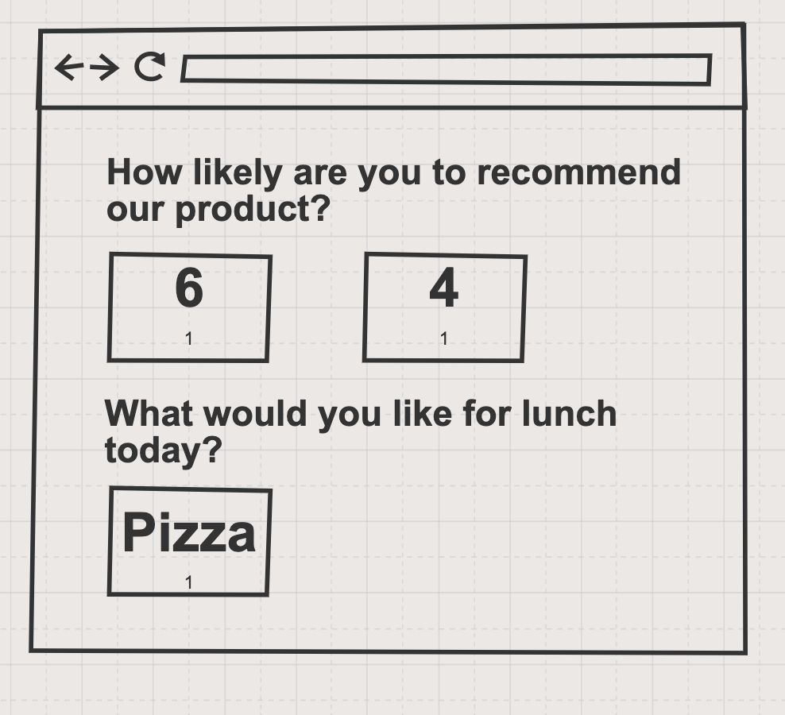

# Interview A

This is the basis for a technical interview project. This interview is suited for a senior engineer with an interest or focus on operations.

This is a client-server project in TypeScript. The frontend is React talking to a backend Express API server. The project is a simple survey tool. (This isn't TeamSense's core code — this is a vast simplifaction of what we can do with surveys.)

# Goals
- Determine your level of software development ability
- Identify your areas of strength

# Instructions

> This exercise should take about an hour.

- Review the log file [`sample.log`](sample.log) and note anything that looks off or that is worth investigating. This will be a topic to discuss with your interviewer. (~ 5 minutes)
    - The log entries are not tied to the sample code base (assume they could be another service)

- Briefly review the files in this folder to understand the code; you're not going to be asked about specifics in this codebase but knowing what's going on will help you in the following exercises. See the Project Structure notes below to guide you. (~ 15 minutes)

- Review the Pull Request you were provided that adds a new feature. (~ 10 minutes)
    - This pull request requires changes. What’s the most critical issue that needs to be addressed? Why?
    - What response would you provide? Please write this out.
    - At TeamSense our practice is to ask clarifying / learning questions in a review, so feel free to do that as well.
    - **Do not submit your pull request**, just share it with your interviewer (via screenshot, screen share, or notes)

- Write code for a new feature. (~ 30 minutes)
    - Build a quick and dirty view that shows the total count of each response to surveys
        - The views should show each unique response to each question with the count of times it was selected
        - For this exercise you can count all responses (don't worry about filtering for repsonses to specific surveys)
        - You may want to create more data to demo this (in `api/src/daos/MockDb/MockDb.json`)
        - One possible design (you are welcome to do anything you want):
          
    - Choose any language you like
    - You are welcome to clone the repo and create a branch to share, but **do not open a pull request**
    - Alternately, you can create your own git repo and share it with us in the interview

# Project Structure
This project is split between a backend API server ih Express and a frontend React app. Those are laid out as follows:

- `api`: backend API server
  - `spec`: test suite
  - `src`: project code
    - `@types`: type definitions for TypeScript
    - `daos`: data access objects (using a mock "database" in a JSON file on disk)
    - `entities`: data classes (models)
    - `pre-start`: Express set up scripts
    - `public`: (future) static assets
    - `routes`: Express routes mapping API end points to data access tasks
    - `shared`: common library functions
    - `views`: a default HTML page for the service
- `client`: frontend React app
  - `public`: static assets
  - `src`: React app and test files
    - `components`: shared React components
    - `entities`: data classes (models)
    - `views`: React views (page layouts)
- `sample.log`: A subset of log file entries to review

# Developer Setup
This code base uses Node.js version 12, so install that.

Open the project (in VSCode or whatever) from this, `interview-a`, folder (i.e. not the repository root) to get the TypesScript linting rules properly synced.

# Running the Code
In one terminal start the backend server:
```
cd api
npm install
npm run start:dev
```

In another terminal start the frontend server:
```
cd client
npm install
npm start
```

Open [`http://localhost:2048`](http://localhost:2048) in your web browser to access the frontend.

The page will reload if you make edits. You will also see any lint errors in the console.

# Test suite
To run API server backend tests:
```
cd api
npm test
```

To run React frontent tests:
```
cd client
npm test
```

The React frontend launches the test runner in the interactive watch mode. See the section about [running tests](https://facebook.github.io/create-react-app/docs/running-tests) for more information.
